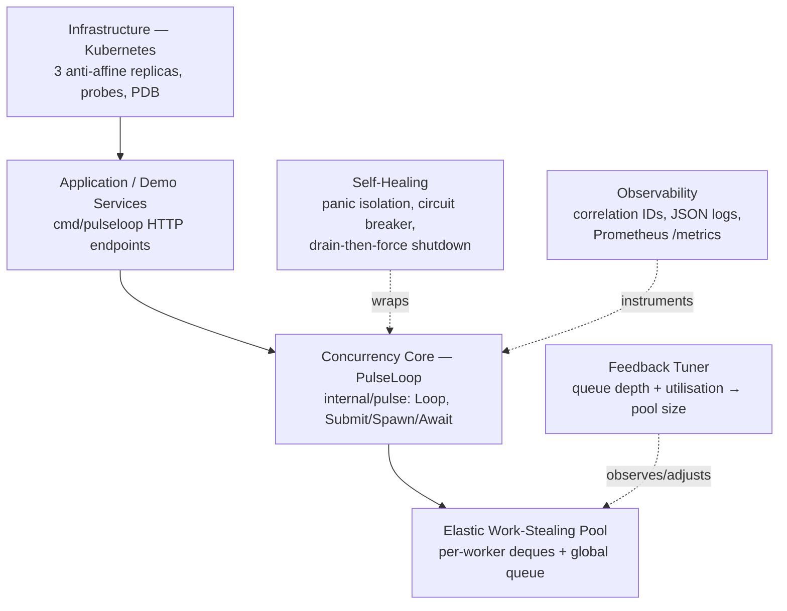

# RLT-MRF Architecture Blueprint v1.0

## Context

RLT-MRF is the synthesis of an evaluation of 20 candidate architectures for a
"recursive loop-threaded multi-layered" system. The recurring failure modes
identified in that evaluation drive every design decision here:

1. **Unbounded recursion** → stack exhaustion, exponential blowup (HRAF, ARWC)
2. **Feedback loop instability** → oscillation, cascading re-processing (SLPF, SOLRA, CFDM)
3. **Blanket redundancy** → resource bloat (MPRSM, TBRTM)
4. **Custom infrastructure where mature tools exist** → operational risk (RRSF, HROB, DRSF)
5. **Undebuggable emergent behaviour** → failed audits (DLSS, PLDE)

## Layers

| Layer | Location | Responsibility |
|---|---|---|
| Infrastructure | `deploy/k8s/` | Placement, redundancy, probing, disruption budgets — delegated to Kubernetes, not reimplemented |
| Application | `cmd/pulseloop/` | HTTP intake, demo recursive workloads, graceful lifecycle |
| Concurrency core | `internal/pulse/loop.go`, `task.go` | Task model, depth budgets, deadlines, structured concurrency |
| Execution | `internal/pulse/pool.go` | Elastic worker pool, work stealing, help-first waiting |
| Feedback | `internal/pulse/tuner.go` | Closed-loop pool sizing from live metrics |
| Self-healing | `internal/pulse/breaker.go`, panic recovery in `pool.go` | Fault isolation and fail-fast on unhealthy dependencies |
| Observability | `internal/pulse/metrics.go` | Zero-dependency Prometheus exposition, latency histogram |

## The loop-threaded processing model

**Submission.** `Loop.Submit` creates a root task (depth 0) with a fresh
correlation ID and the configured deadline, and enqueues it on a *bounded*
global queue. A full queue rejects with `ErrQueueFull` — backpressure is a
first-class outcome, not an error condition to hide.

**Recursive spawning.** Inside a task, `TaskCtx.Spawn` creates a child that
inherits the parent's context (deadline + cancellation) and correlation ID and
consumes one unit of the depth budget. Children are pushed LIFO onto the
spawning worker's local deque — the cache-friendly choice — and idle workers
steal FIFO from the front, which naturally spreads the *oldest, widest*
subtrees first.

**Structured concurrency.** A task's handle resolves only when its entire
subtree has completed; child errors are joined into the parent's result.
Cancelling any handle cancels its subtree. This is what makes recursive
behaviour *auditable*: one correlation ID, one deterministic completion order
contract, no orphaned goroutines.

**Help-first waiting.** The classic deadlock in bounded pools — every worker
blocked waiting for children that no free worker can run — is eliminated by
*helping*: a worker that must wait (`Await`, or the implicit end-of-task join)
executes queued tasks in the meantime. A pool of size 1 can run arbitrarily
deep parent-waits-for-child recursion (proven in `TestAwaitInsideTask`).

**Closed feedback loop.** The tuner samples queue depth, in-flight count, and
worker count every `TuneInterval`. Policy is deliberately asymmetric to
prevent the oscillation failure mode: scale **up** proportionally to backlog
immediately; scale **down** one worker at a time only after four consecutive
under-utilised samples. Workers retire themselves cooperatively when the
target drops.

**Shutdown.** Graceful by default: reject new work, drain, then — only when
the caller's context expires — cancel all subtree contexts and let workers
resolve the now-fast-failing remainder. Every handle always resolves.

## How the design neutralises the identified weaknesses

| Weakness class | Countermeasure | Verified by |
|---|---|---|
| Runaway recursion | Hard depth budget per subtree; spawn denial is a typed, degradable error | `TestDepthBudgetEnforced`, fib demo's inline fallback |
| Pool deadlock | Help-first waiting | `TestAwaitInsideTask` (pool of 1) |
| Feedback oscillation | Asymmetric policy with hysteresis | `TestFeedbackResize` |
| Resource bloat | Selective redundancy: 3 stateless replicas + PDB; no consensus layer where none is needed | ADR-0003 |
| Unbounded intake | Bounded queue, typed rejection | `TestBackpressure` |
| Undebuggable emergence | Correlation IDs on every subtree, full metric coverage, deterministic completion contract | `TestCorrelationIDInheritance` |
| One bad task kills a worker | Per-task panic isolation | `TestPanicIsolation` |

## Measured performance

On the development container (race detector off, 20 parallel HTTP requests,
each a width-4 depth-5 recursive fan-out): 27,300 tasks in ~74 ms ≈ **370k
tasks/s** end-to-end through HTTP, against the 5k ops/s acceptance target.
