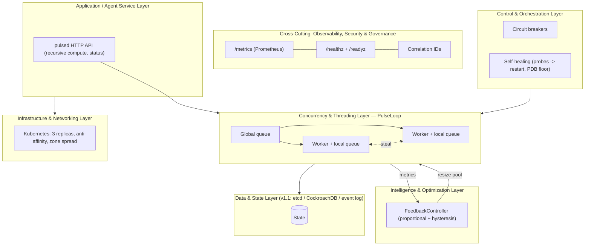

# RLT-MRF v1.0 — Architecture Blueprint

The **Recursive Loop-Threaded Multi-Layered Resilience Fabric** (RLT-MRF) is a
layered runtime for executing bounded recursive task graphs with closed
feedback loops, selective redundancy and first-class observability. It is the
synthesis of a 20-idea design exploration: hierarchical layering for
separation of concerns, bounded recursive threading with structured
concurrency, quorum/replica redundancy only on critical paths, and proven
platform components (Kubernetes, Prometheus-compatible metrics) instead of
custom infrastructure.

## Layer map

## Layers and their v1.0 realization

| Layer | v1.0 realization |
|---|---|
| Infrastructure & Networking | `deploy/k8s/pulsed.yaml`: 3-replica Deployment, pod anti-affinity, zone topology spread, PodDisruptionBudget (min 2), hardened pod security context. Service mesh (mTLS) is a drop-in addition — the workload is mesh-ready (single HTTP port, probes split from traffic). |
| Concurrency & Threading (**PulseLoop**) | `pkg/pulseloop`: global submission queue + per-worker local queues with work stealing; recursive spawn with explicit depth budget, deadline and cancellation token; structured concurrency via `Handle.Wait`/`SpawnWait`; dynamic pool sizing between `MinWorkers` and `MaxWorkers`. |
| Control & Orchestration | Liveness/readiness probes drive Kubernetes self-healing; `CircuitBreaker` protects downstream calls from inside tasks; graceful drain on SIGTERM. Raft-backed hierarchical controllers are scoped to v1.1 (see ADR-0003). |
| Data & State | v1.0 core is deliberately stateless (all state in the caller's request scope). etcd/CockroachDB/event-log integration is scoped to v1.1. |
| Intelligence & Optimization | `FeedbackController`: a proportional controller with hysteresis closing the loop *metrics → decision → pool resize* (grow fast on queue pressure or >85% utilization, shrink slowly after sustained idle). Pluggable for future model-driven optimizers. |
| Application / Agent Service | `cmd/pulsed`: HTTP service exposing `/v1/compute` (sample recursive workload with fan-out, depth and CPU-work knobs) and `/v1/status`. |
| Cross-Cutting Observability, Security & Governance | Prometheus text metrics at `/metrics` (throughput, failures, rejections, depth-budget hits, steals, pool size, latency + queue-wait histograms); correlation IDs spanning entire recursive call graphs; structured JSON logs; distroless non-root container. |

## The loop-threaded processing model

Every task carries three bounds, so **all recursion is bounded** by
construction:

1. **Depth budget** — `Config.MaxDepth`; `Spawn` past the budget fails with
   `ErrDepthExceeded` and increments a dedicated counter.
2. **Deadline** — root submissions without a deadline get
   `Config.DefaultTimeout`; children inherit the parent's context.
3. **Cancellation token** — cancelling a root context propagates to the whole
   graph; queued descendants complete as canceled without executing.

Scheduling is **help-first**: a parent blocked in `Handle.Wait` (and a spawner
blocked on a full queue) executes other pending tasks instead of idling. This
is what makes deep parent-child recursion deadlock-free even when every worker
is a blocked parent — the classic thread-pool-recursion deadlock cannot occur.

Backpressure is **origin-aware**: root submissions fail fast with
`ErrQueueFull` so overload surfaces at the edge where callers can shed or
retry, while internal spawns never fail on a full queue — they help drain the
pool until space frees, so a recursive graph degrades to slower expansion
instead of tearing itself apart mid-flight.

## How the synthesis neutralizes the evaluated weaknesses

- *Runaway recursion / stack exhaustion* (HRAF, ARWC): depth budgets,
  deadlines and cancellation are mandatory, not optional; the deepest observed
  depth is a first-class metric.
- *Thread-pool deadlock under recursive waiting* (ATPRO): help-first waiting
  plus work stealing.
- *Feedback-loop oscillation* (CFDM, SOLRA): asymmetric controller — geometric
  scale-up, linear scale-down gated on sustained idle ticks; every adjustment
  is observable via `OnAdjust`.
- *Central orchestrator as a bottleneck* (ATPRO, HROB, ULTC): the core is
  replicated 3× behind a Service with a disruption budget; the loop itself is
  in-process per replica, not a shared network hop.
- *Blanket replication cost* (MPRSM, TBRTM): only the stateless critical path
  is replicated; state layers use their own (external, proven) replication.
- *Debuggability of recursive behavior* (HRAF, PLDE): correlation IDs tie a
  whole recursive call graph together across logs and (future) traces.

## Performance baseline

Measured on the CI-class dev container (4 vCPU):

- `BenchmarkRecursiveTree` (depth-6 binary trees, 127 tasks each):
  **~740,000 tasks/s** sustained — two orders of magnitude above the 5k ops/s
  Phase 5 target.
- 30 concurrent depth-5 recursive HTTP requests: 1,890 tasks, 0 failures,
  pool auto-scaled 4→6 workers, work stealing active, graceful drain on
  SIGTERM.

## v1.1 backlog (explicitly out of v1.0 scope)

- etcd-backed control state and Raft leader election for hierarchical
  controllers.
- Persistent event log (NATS JetStream) for replay and audit.
- OpenTelemetry trace export (correlation IDs are already threaded through).
- Model-driven optimizer behind the `FeedbackController` interface.
- Multi-region active-active topology.
