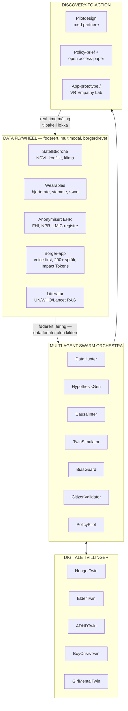
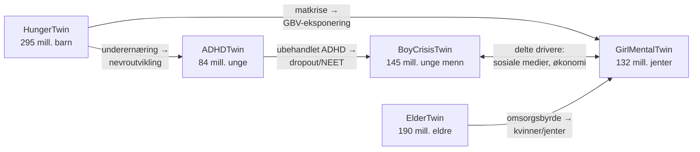
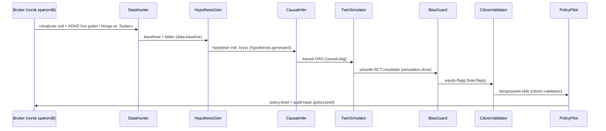

# SymbioForge Nexus — arkitektur (2026)

## Oversikt

## 1. Multi-Agent Swarm Orchestra

Agentene kommuniserer over en **meldingsbuss med kjedet hash** (audit-chain):
hver melding er innholdsadressert, og hele resonneringskjeden kan revideres og
reproduseres bit-for-bit. Referanseimplementasjon: [`core/symbioforge/bus.py`](../core/symbioforge/bus.py).

| Agent | Rolle | Inndata → utdata | Produksjon (2026+) |
|-------|-------|------------------|--------------------|
| **DataHunter** | Finner relevante tvillinger + baselines + kilder | spørsmål → `data.baseline` | RAG over UN/WHO/Lancet + føderert spørring mot registre |
| **HypothesisGen** | Testbare hypoteser, inkl. kryssforbindelser | tvillinger → `hypotheses.generated` | LLM med STORM-lignende multiperspektiv-generering |
| **CausalInfer** | Kausal DAG med effektstørrelser | tvillinger → `causal.dag` | DoWhy/EconML-pipelines, instrumentvariabler, DiD |
| **TwinSimulator** | Virtuelle RCT-er over tvillingene | DAG + tiltak → `simulation.done` | Kalibrerte agent-baserte modeller, quantum-inspired optimering |
| **BiasGuard** | Blokkerer generalisering ved lav datadekning | tvillinger → `bias.flags` | Fairness-metrikker per subgruppe, Global South-review |
| **CitizenValidator** | Berørte grupper skårer relevans/verdighet | tiltak → `citizen.validation` | Faktiske panelrunder via app, DAO-avstemming, tokens |
| **PolicyPilot** | Policy-brief + pilotdesign | alt over → `policy.brief` | Auto-genererte briefs med kost/nytte per region |

**Kontrakten er hellig:** hver agent er utbyttbar så lenge topic-inn/topic-ut
holdes. Det er slik systemet selv-evoluerer — en bedre CausalInfer swappes inn
uten å røre resten.

## 2. Digitale tvillinger

Én tvilling per krise + eksplisitte kryssforbindelser:

Hver tvilling har: baseline-indikatorer (FN/WFP/UNICEF/Lancet/GBD 2025-26),
årlig drift uten tiltak, og en intervensjonskatalog med enhetskostnad (mrd. NOK)
og evidensbasert effektstørrelse. Effekter **multipliseres** (uavhengige
reduksjoner), aldri summeres. Se [`core/symbioforge/twins.py`](../core/symbioforge/twins.py).

I produksjon: tvillingene kjører kontinuerlig mot sanntidsstrømmer (satellitt-
NDVI for HungerTwin, stemmeanalyse for ElderTwin, skoledata for ADHD/Boy/Girl)
og rekalibreres ukentlig via føderert læring.

## 3. Discovery-to-Action-løkka

Løkka er **lukket**: pilotene som designes måles i sanntid, og målingene går
tilbake som ny treningsdata. Det er selvforbedringsmekanismen.

## 4. Dataplattform

- **Føderert læring:** modeller reiser til dataen, aldri omvendt. Norge beholder
  suverenitet (FHI/NPR bak Helseanalyseplattform-lignende mur); LMIC-partnere
  beholder eierskap og får modellene tilbake.
- **Homomorf kryptering + differential privacy** på aggregater som krysser
  landegrenser.
- **Blockchain-forankring:** audit-hashen fra meldingsbussen ankres periodisk
  til offentlig kjede — bevis for at forskningskjeden ikke er manipulert.
  (Referanseimplementasjonen har hash-kjeden; ankringen er integrasjonspunkt.)
- **Impact Tokens:** borgere som bidrar data/validering tjener tokens som kan
  veksles til hjelpetjenester eller doneres. Styres av DAO-en (se ETIKK-PERSONVERN.md).

## 5. Killer-features

- **VR/AR Empathy Labs:** beslutningstakere «blir» en sulten gutt eller ensom
  eldre i 5 minutter før de leser policy-briefen. Bygger på tvilling-scenarioene.
- **Predictive + Scenario Engine:** quantum-inspired optimering over
  intervensjons-porteføljer → «best buy» per budsjettkrone mot 2035.
  (Dashboardets scenariomotor er den deterministiske forløperen.)
- **Norsk edge:** FHI/UiO/SINTEF-data, GDPR+-etikk som eksportvare, Norge som
  testland før global skalering.

## 6. Teknologivalg (produksjon)

| Lag | Valg | Hvorfor |
|-----|------|---------|
| Agent-runtime | Claude Agent SDK / LangGraph | verktøybruk + delstate + sporbarhet |
| Kausal inferens | DoWhy, EconML | eksplisitte antakelser, refutasjonstester |
| Føderert læring | Flower / NVFlare | modent, rammeverk-agnostisk |
| Tvilling-sim | Mesa (ABM) + PyMC (kalibrering) | transparent + usikkerhetskvantifisering |
| Data-mesh | Delta Lake + OpenLineage | lineage er førsteklasses |
| App | React Native + Whisper (voice-first) | 200+ språk via tale |
| DAO/tokens | eksisterende L2 (lav energi) | ikke bygg egen kjede |

Referansekjernen i dette repoet er **avhengighetsfri med vilje** — den er
kontrakten de virkelige komponentene skal oppfylle.
