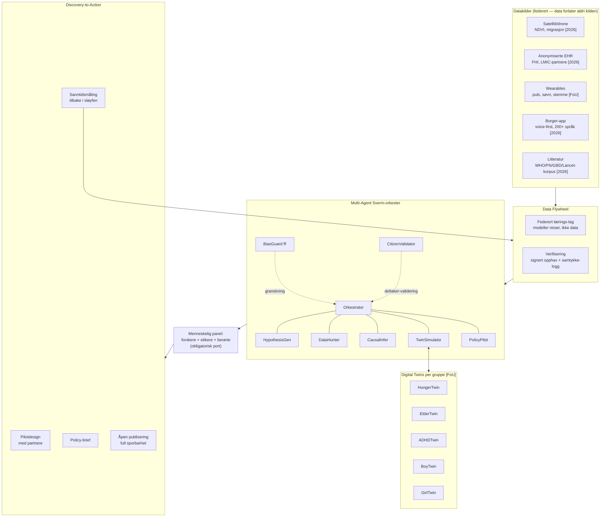
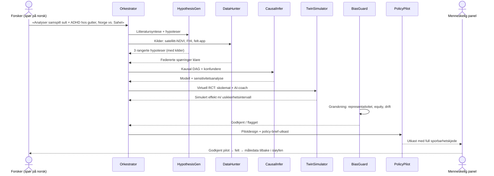
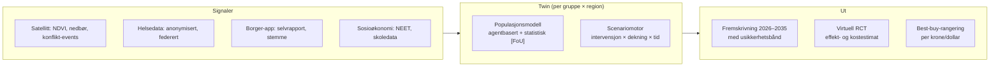
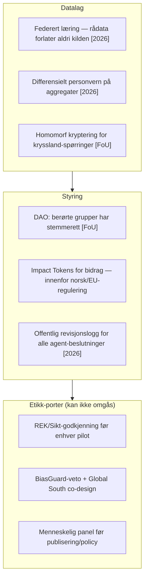

# SymbioForge Nexus — arkitektur (2026)

Arkitekturforslag for et desentralisert, agent-drevet forskningsøkosystem.
Diagrammene er skrevet i Mermaid og rendres direkte på GitHub.

> Status-notasjon i dette dokumentet:
> **[2026]** = kan bygges med dagens teknologi · **[FoU]** = krever forskning/modning · **[Visjon]** = retningsgivende mål

---

## 1. Systemoversikt

**Nøkkelvalg:** BiasGuard og CitizenValidator sitter *utenfor* produksjonskjeden og gransker den — de kan blokkere, ikke overstyres. Alt som går ut (pilot, policy, publisering) passerer et menneskelig panel. Sløyfen lukkes ved at måledata fra piloter mates tilbake i flywheelet.

---

## 2. Agentroller

| Agent | Rolle | Verktøy | Autonomi |
|---|---|---|---|
| **Orkestrator** | Dekomponerer spørsmål, ruter til agenter, samler svar med sporbarhet | Oppgavegraf, budsjett-/kostkontroll | Kan ikke publisere eller starte piloter |
| **HypothesisGen** | Genererer testbare hypoteser fra litteratur + data-gap | RAG over WHO/FN/GBD-korpus | Forslag merkes alltid som ubekreftet |
| **DataHunter** | Finner og kvalitetsvurderer kilder, forhandler federert tilgang | Katalog over datakilder, samtykke-API | Kun lesetilgang; aldri rådata ut av kilden |
| **CausalInfer** | Bygger kausale grafer (DAG), kjører sensitivitetsanalyser | DoWhy/EconML-aktige verktøy | Usikkerhet rapporteres alltid, aldri skjules |
| **TwinSimulator** | Kjører scenario- og virtuelle RCT-er mot twins | Populasjonsmodeller, scenariomotor | Resultater merkes «simulert» til de er felt-validert |
| **PolicyPilot** | Oversetter funn til pilotdesign og policy-brief med kostnadsanslag | Maler, partnerregister | Utkast kun — mennesker godkjenner |
| **BiasGuard ⛨** | Reviderer hele kjeden for skjevhet, representativitet, equity | Fairness-metrikker, demografisk dekning | Vetorett; logger offentlig |
| **CitizenValidator** | Sjekker funn mot levde erfaringer fra berørte via appen | Panelspørringer, Impact Tokens | Kan flagge og kreve ny runde |

---

## 3. Discovery-to-Action-sløyfen

Tidsmålet er ikke «paper på 10 minutter» — det realistiske målet **[2026]** er at *utkastet* (hypoteser, kausalmodell, simulering, pilotskisse) foreligger på minutter–timer, mens validering, etikk og felt-pilot fortsatt tar den tiden kvalitet krever. Gevinsten er at ventetiden flyttes fra manuelt sammenstillingsarbeid til faktisk vitenskapelig vurdering.

---

## 4. Digital twins per gruppe

| Twin | Primærindikator | Eksempel på virtuell RCT |
|---|---|---|
| HungerTwin | Andel barn i IPC 3+ | Næringsrik skolemat vs. kontantoverføring |
| ElderTwin | Ensomhetsskår + demensinsidens | AI-kompis-app vs. fysiske besøksordninger |
| ADHDTwin | Skolegjennomføring, symptomtrykk | Wearables + skoletilpasning vs. standard oppfølging |
| BoyTwin | NEET-andel, selvmordsrate | Mentorprogram + praksisplasser vs. basis |
| GirlTwin | Internaliserende symptomer | Sosiale medier-intervensjon + skolebasert DBT vs. basis |

Kryssimuleringer (f.eks. HungerTwin × ADHDTwin) kjøres ved å koble twinnenes utganger: underernæringsbane inn som kovariat i ADHD-modellen.

---

## 5. Personvern, styring og etikk

Prinsipp: **ingen autonom handling mot mennesker.** Agentene produserer utkast og simuleringer; alle intervensjoner, publiseringer og policyråd går gjennom menneskelige porter med logget ansvar.

---

## 6. Teknologivalg (realistisk 2026-stack)

| Lag | Valg | Status |
|---|---|---|
| Agent-orkestrering | Claude Agent SDK / åpne agent-rammeverk, oppgavegraf med sporbarhet | [2026] |
| Kunnskapssyntese | RAG over åpne WHO/FN/GBD/Lancet-korpus, sitatplikt per påstand | [2026] |
| Kausal inferens | DoWhy, EconML, sensitivitetsanalyse som standard | [2026] |
| Twins | Agentbaserte + bayesianske populasjonsmodeller, åpen kildekode | [FoU] |
| Federert læring | Flower/åpne FL-rammeverk hos datapartnere | [2026] |
| Verifisering | Signert dataopphav + append-only revisjonslogg (blockchain valgfritt) | [2026] |
| Borger-app | Voice-first PWA, on-device transkripsjon, samtykke per datapunkt | [2026] |
| VR/AR Empathy Labs | WebXR-scenarier for beslutningstakere | [Visjon] |
| Quantum-inspired optimering | Klassiske heuristikker først; kvante når det faktisk slår dem | [Visjon] |

---

## 7. Grensesnitt mot prototypen

Prototypen i [`../prototype/index.html`](../prototype/index.html) implementerer en *simulert* versjon av:

- Stat-fliser for de fem problemområdene (avsnitt 1-tallene fra README)
- Discovery-to-Action-sløyfen fra avsnitt 3 som animert pipeline
- Twin-scenariomotoren fra avsnitt 4 som interaktiv fremskrivning med justerbar dekning/intensitet
- Agentrollene fra avsnitt 2 som statuskort

Alle tall i prototypen er illustrative. Neste steg mot ekte funksjonalitet er MVP-fase 1 i README-en: RAG-syntese med sporbarhet over åpne korpus.
