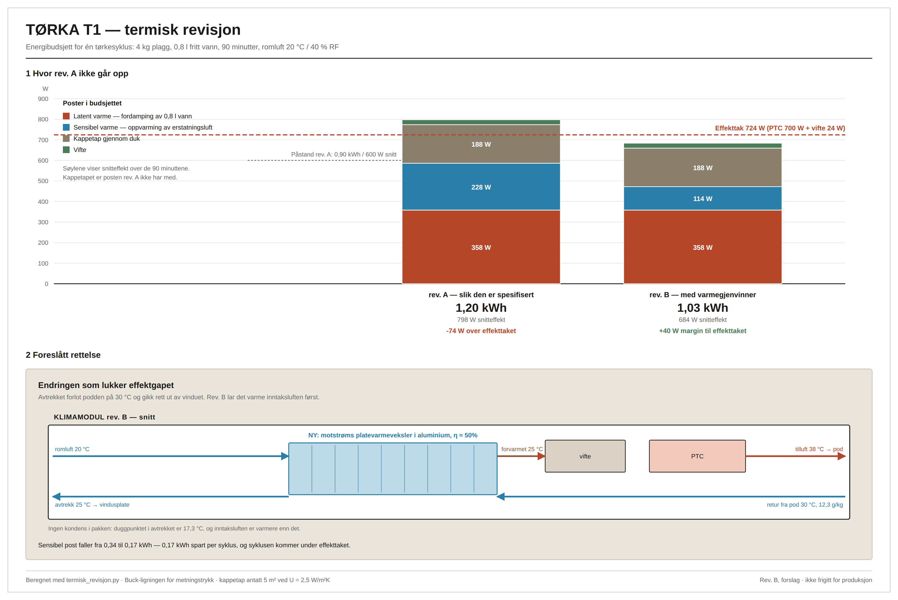

# TØRKA T1 — analyse og videreføring

**Kilde:** `claude/product-design-pitch-459m3f` → `prosjekter/torka-t1/`
**Status inn:** rev. A, konseptfase
**Status ut:** rev. B foreslått, med én rettelse som må gjøres før prototyping



---

## 1  Hva det er

Et sammenleggbart tørkerom på 0,41 m² gulvflate: en foldbar pod i aluminium og
belagt ripstop, med avtakbar klimamodul i bunnen. Skånsomt oppvarmet luft
(32–38 °C) føres opp gjennom plaggene og inn i støvler og votter via seks dyser.
To fuktsensorer måler differansen mellom tilluft og retur; når den flater ut, er
plaggene tørre og syklusen stopper av seg selv. Den mettede luften går ut av
rommet gjennom en slange til vindusplaten.

| | |
|---|---|
| Utfoldet / sammenlagt | 640 × 640 × 1780 mm / 780 × 220 × 180 mm |
| Vekt | 8,4 kg |
| Enhetskostnad ved 20 stk | NOK 4 573 |
| Salgspris eks. mva. | NOK 8 900 |
| Bruttomargin | 48,6 % ved 20 stk |

---

## 2  Hvorfor topp 3

**Problemet er målbart, ikke retorisk.** Et vått sett vinterklær bærer 0,8–2 l
fritt vann, og alt fordamper inn i stua. Dette er det eneste av de sju
alternativene i pitchen som gjør rommet *tørrere* under bruk i stedet for
våtere.

**Kjøperen har allerede budsjett.** En barnehage sammenligner mot et
fastmontert tørkeskap til 25 000–45 000 kr med elektriker og bygningsarbeid.
En familie sammenligner mot et ekstra sett vinterklær per barn, 4 000–6 000 kr,
som må kjøpes på nytt hvert år. Prispunktet på 8 900 kr er satt mot
alternativkostnaden, ikke mot materialkostnaden. Det er riktig gjort.

**Sikkerheten ligger i fysikken.** Et selvbegrensende PTC-element kan ikke gå
termisk løpsk selv ved full tildekking, uansett hva styringen finner på. Det er
forskjellen på et produkt som kan sertifiseres og et som ikke kan.

**Kombinasjonen er reelt ny.** Ingen av de sju konkurrentløsningene gjør alle
tre tingene samtidig: føre luft *gjennom* plagget, holde temperaturen lav nok
for ull og membran, og få fukten *ut av rommet*.

**Dokumentasjonen holder mål.** CAD-arket er et ekte konstruksjonsark — oppriss,
snitt gjennom luftveien, plan over plenum og seks detaljsnitt, med toleranser
(ISO 2768-m, knuteboring H9) og standardreferanser (EN 60335-2-43, EN 55014).
Innholdet rendres fra én modell til både `.docx` og `.md`, så de to kan ikke gå
fra hverandre.

---

## 3  Feilen som må rettes først

Kjør [`termisk_revisjon.py`](termisk_revisjon.py):

```
Post                                   rev. A     rev. B
--------------------------------------------------------------
Latent varme (fordamping)             0.537 kWh    0.537 kWh
Sensibel, erstatningsluft             0.342 kWh    0.171 kWh
Kappetap gjennom duk                  0.281 kWh    0.281 kWh
Vifte                                 0.036 kWh    0.036 kWh
--------------------------------------------------------------
SUM                                   1.197 kWh    1.026 kWh
Snitteffekt over 90 min                   798 W        684 W
Tilgjengelig effekt (PTC + vifte)         724 W        724 W
Margin                                    -74 W         40 W
```

**Rev. A oppgir 0,90 kWh. Regnet fra bunnen blir det 1,20 kWh — 33 % mer — og
798 W snitteffekt mot et effekttak på 724 W.** Produktet kan ikke levere sin
egen spesifikasjon.

Avviket er nesten nøyaktig kappetapet (0,281 kWh). Rev. A har regnet med
fordampingsvarmen og oppvarmingen av erstatningsluften, men ikke med varmen som
går ut gjennom duken. Med 5 m² duk og U ≈ 2,5 W/m²K ved 15 K temperaturforskjell
er det 188 W — over en fjerdedel av hele PTC-elementets kapasitet.

### Det som *holder*

Massebalansen er riktig, og det er verdt å si tydelig. Ved 35 °C og 35 % RF i
podden mot 20 °C og 40 % RF i rommet er differansen 6,53 g vann per kg luft.
For å bære 0,8 l ut på 90 minutter trengs **70 m³/h — 74 % av viftens 95 m³/h**.
Spjeldet har margin, og syklustiden på 90 minutter er fysisk oppnåelig.
Problemet er utelukkende energi, ikke luftmengde.

---

## 4  Rev. B — foreslåtte endringer

### 4.1 Motstrøms platevarmeveksler i klimamodulen (må gjøres)

Avtrekket forlater podden på ca. 30 °C og går rett ut vinduet. La det varme
inntaksluften først. Ved 50 % temperaturvirkningsgrad faller den sensible posten
fra 0,342 til 0,171 kWh, og syklusen lander på **1,03 kWh / 684 W — 40 W under
taket.**

Duggpunktet i avtrekket er 17,3 °C, og inntaksluften er 20 °C. **Det blir ingen
kondens i pakken**, så veksleren trenger verken dren eller frostsikring. Det er
en ren aluminiumspakke uten bevegelige deler.

Bonusen er kommersiell: «gjenvinner varmen fra avtrekket» er et bedre
salgsargument enn «blåser varmen ut vinduet», og det styrker påstanden om at
rommet blir tørrere.

Kostnad: anslagsvis 120–180 kr per enhet i småserie. Marginen tåler det.

### 4.2 Alternativ hvis veksleren forkastes

Hev PTC-elementet til 1000 W. Strømtrekket går fra 3,15 A til 4,45 A, fortsatt
godt innenfor en vanlig 10 A-kurs, og nullinstallasjons-argumentet står. Men da
øker energiforbruket per syklus i stedet for å falle, og «0,9 kWh mot
tørketrommelens 2,5–4 kWh» blir til 1,2 kWh — fortsatt bra, men mindre skarpt.

**Anbefaling: veksler, ikke større element.**

### 4.3 Oppgi energi som spenn, ikke som ett tall

Rev. A oppgir «ca. 0,9 kWh». Rev. B bør oppgi **1,0–1,3 kWh avhengig av
romtemperatur og last**, med forutsetningene i vedlegget. Et enkelt tall som
ikke tåler etterregning er en garantisak i markedsføringsmateriell.

### 4.4 Snu rekkefølgen på markedet

Pitchen setter barnefamilier som primærmålgruppe og B2B som sekundær. Snu det.

Barnehager og utstyrsutleie kjøper flere enheter av gangen, har innkjøpsbudsjett
som allerede eksisterer, tåler et prispunkt på 8 900 kr uten å blunke, og gir
deg brukstall fra daglig drift i stedet for fra en familie som tørker klær to
ganger i uka. Familiesegmentet er større, men det er dyrere å nå og krever
merkevarebygging du ikke har.

### 4.5 Forhåndsselg pilotserien før verktøykostnadene

Dekningspunktet ligger på enhet nr. 15 av 20. Det betyr at hele
engangskostnaden på 62 000 kr er ubeskyttet hvis pilotserien ikke selges.
**Skaff tre intensjonsavtaler før du bestiller verktøy til bunnkaret.**

### 4.6 Sertifisering er den virkelige porten

EN 60335-2-43 og EMC-prøving er 27 000 kr av de 62 000, og en runde til hvis
noe endres etterpå. Derfor må **rev. B fryses før prototyping**, ikke etter.
Veksleren må inn nå — ikke som en forbedring i rev. C etter at testrapporten
er betalt.

### 4.7 Sjekk navnet

«TØRKA» er nær et generisk norsk ord og vanskelig å beskytte. Gjør et
varemerkesøk i klasse 11 før noe trykkes. Dette er en 3 000-kroners sjekk som
kan spare en ommerking.

---

## 5  Styrker, svakheter, muligheter

| | |
|---|---|
| **Styrker** | Målbart problem · kjøper med eksisterende budsjett · passiv sikkerhet i PTC-elementet · ekte konstruksjonsdokumentasjon · reparerbar og modulær · nullinstallasjon åpner leiemarkedet |
| **Svakheter** | Energibudsjettet feilet med 33 % · alle ytelsestall er beregnet, ingen målt · 62 000 kr engangskostnad før første salg · 8,4 kg er tungt for «sammenleggbart» · konfeksjon av duk krever en underleverandør du ennå ikke har |
| **Muligheter** | Varmegjenvinning som salgsargument og patentkandidat · B2B-abonnement på service og filterbytte · utleiemarkedet (hytte, brakkerigg, festival) · EU-marked med samme klimaproblem |
| **Trusler** | En etablert hvitevareprodusent kan kopiere konseptet på 12 måneder · sertifiseringsrunde nr. 2 hvis designet ikke fryses · PTC + duk + tildekking er nettopp den kombinasjonen et prøveinstitutt vil se hardest på |

---

## 6  Visuelle konsepter og designretning

### Det som finnes

`figurer/torka-t1-tegning.svg` — konseptriss rev. A: oppriss, snitt B–B gjennom
luftveien, plan C–C over plenum, detalj C (hjørneknute) og detalj A
(klimamodul). Generert programmatisk fra `verktoy/lag_tegning.py`, så det kan
regenereres når mål endres.

### Det som mangler før pilotsalg

**1 · Rev. B av konseptrisset.** Klimamodulen må tegnes om med veksleren inne.
Luftveien i snitt B–B endres: inntak → veksler (kald side) → vifte → PTC →
plenum → plagg → retursjakt → veksler (varm side) → spjeld → avtrekk.

**2 · Fotorealistisk produktbilde i bruk.** Ikke produktet på hvit bakgrunn —
podden i en norsk gang klokka 16.45 i november, med to barnedresser og et par
støvler på dyseportene. Lyssetting: kaldt vinterlys fra vinduet mot den varme
LED-listen. Dette er bildet som selger til foreldre.

**3 · Foldesekvens i fire steg.** Sammenlagt → reist → lastet → i drift. Enten
som strektegning eller som fire fotografier. Det er dette som gjør
«sammenleggbart» troverdig, og det er første spørsmål enhver kjøper stiller.

**4 · Snitt-animasjon av luftveien.** 15 sekunder, luftstrømmen farget etter
temperatur og fuktighet. Til nettsiden og til anbudspresentasjoner.

**5 · Fargekart.** Rev. A spesifiserer materialer, ikke uttrykk. Podden er i dag
teknisk grå. Foreslått retning: **klaranodisert aluminium mot en varmgrå duk
(NCS S 4500-N) med én signalfarge i rustorange** på dyseporter, kamlåser og
LED-list — altså akkurat de delene brukeren skal ta på. Det gir et
funksjonelt fargesystem i stedet for pynt.

### Designregler å holde fast ved

- Ingen skjult kompleksitet i brukergrensesnittet: **én knapp starter
  standardsyklus.** Appen er tillegg, aldri forutsetning.
- Alt brukeren rører ved er rustorange. Alt annet er nøytralt.
- Ingen skjerm. En RGB-list som går fra varmt til grønt er nok informasjon.
- Reparerbarhet skal være synlig: åtte skruer, ikke limte skjøter.

---

## 7  Slik ser det ut ferdig

Podden står utfoldet i gangen — 64 cm i kvadrat, i overkant av et sammenlagt
tørkestativ. Duken er varmgrå, matt, uten logo bortsett fra et lite preg nederst
til høyre. Seks rustorange dyseporter sitter i en rad langs plenumkanten; to av
dem har støvler tredd på seg. En jakke og to barnedresser henger på skinnen bak
en lukket, vannavvisende glidelås.

Fra klimamodulen går en 100 mm slange i en myk bue til vindusplaten. Modulen gir
en lav, jevn tone — under 42 dB(A), omtrent som en kjøleskapskompressor. LED-
listen langs bunnkanten lyser rolig ravgult.

Halvannen time senere slår listen over til grønt, viften stanser, og telefonen
sier fra. Plaggene er tørre og luktfrie, støvlene tørre innerst i tåa, og
luftfuktigheten i stua er lavere enn den var da syklusen startet.

---

## 8  Neste konkrete steg

| # | Handling | Hvorfor nå | Tid |
|---|---|---|---|
| 1 | Tegn inn varmeveksleren, frys rev. B | Sertifisering låser designet | 1 uke |
| 2 | Bygg testrigg: pod, modul, to SHT40, strømmåler | Alle tall er beregnet, null er målt | 2 uker |
| 3 | **Mål** tørketid og kWh på 4 kg standardlast | Porten. Bommer den, endres alt annet | 1 uke |
| 4 | Tre intensjonsavtaler med barnehager | Beskytter 62 000 kr i engangskostnad | Parallelt |
| 5 | Varemerkesøk klasse 11 | Billig nå, dyrt etter trykking | 2 dager |
| 6 | Prototype 1 mot målte tall | Først nå er tallene ekte | 3 uker |
| 7 | Ekstern el-sikkerhetstest | Etter frys, ikke før | 4 uker |

**Porten etter steg 3:** måler du under 1,1 kWh og under 100 minutter på
standardlasten, er produktet reelt. Bommer du på begge, er det duken og
kappetapet som må løses — ikke elektronikken.

---

## 9  Kjør beregningene

```bash
python3 termisk_revisjon.py     # energibudsjett rev. A vs rev. B
python3 lag_figur.py            # regenererer figuren fra beregningen
```

Kun standardbiblioteket. Metningstrykk etter Buck-ligningen. Alle forutsetninger
ligger som navngitte konstanter øverst i `termisk_revisjon.py` — endre dem og
figuren følger med.
