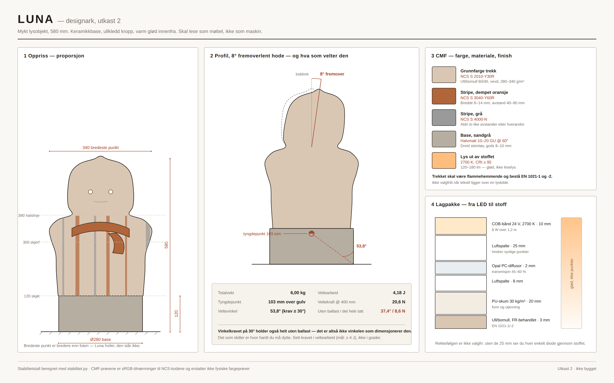

# Luna — analyse og videreføring

**Kilde:** `claude/luna-design-specs-ocybyo` → `luna/` · [PR #9](https://github.com/fotoblinkskudd2-create/kreative-vibe-prosjekter/pull/9)
**Status inn:** spec utkast 1, fem åpne punkter, ikke bygget
**Status ut:** tre av fem punkter avklart her, ett dimensjonerende krav rettet



---

## 1  Hva det er

Et mykt lysobjekt på 580 mm: dreid keramikkbase, ullkledd kropp med diskrete
vertikale striper, integrert skjerf, og en varm glød innenfra. Hodet er lett
fremoverlent. Øynene puster på 0,20 Hz. Ingen knapper, ingen synlig plast, ingen
skarpe kanter — minste konvekse radius er satt til R15 mm som regel.

Den skal lese som møbel, ikke som maskin.

---

## 2  Hvorfor topp 3

**Det er det eneste i repoet med en egen estetisk stemme.** Alt annet er
enten teknisk arbeid eller idélister. Luna har en holdning, og den er
konsekvent gjennomført helt ned til hvorfor hodet vippes 8° og ikke 5 eller 10:
«10° begynner å se trist ut; 5° er umerkelig».

**Specen er uvanlig disiplinert for et estetisk prosjekt.** NCS-koder på hver
farge. Glansverdi i GU. Flammehemming etter EN 1021-1/-2 som krav, ikke som
ønske. En lagpakke fra LED til stoff der hver luftspalte har en grunn — de
25 mm er der for å hindre synlige dioder og brune brennmerker, ikke som
slingringsmonn.

**Den er faktisk byggbar.** Byggekurset har sju moduler med tidsestimat og
avhengigheter, materialliste med alternativer, og en snarvei (kjøp en
steintøypotte i riktig mål) som innrømmer at prototype 1 ikke trenger dreieskive
og ovn. 22–30 timer, 3 500–5 500 kr.

**Den lister sine egne åpne punkter.** Fem stykker, eksplisitt, i §8. Det er
sjeldnere enn det burde være.

---

## 3  Feilen som må rettes

Kjør [`stabilitet.py`](stabilitet.py):

```
Post                                         kg    h mm
------------------------------------------------------------
Ballast (kvartssand i basebunn)            3.50      45
Keramikkbase, dreid steintøy 8–10 mm       1.20      62
Skjelett, skum, vatt og trekk              0.90     330
COB-bånd, diffusor, aluminiumsplate        0.25     300
Styrekort, kabling, gjennomføring          0.15      80
------------------------------------------------------------
Totalt                                     6.00     103

    ballast     total      CG   velte    arbeid  kraft @400mm
     0.0 kg   2.50 kg    183 mm   37.4°    1.16 J         8.6 N
     2.0 kg   4.50 kg    122 mm   49.0°    2.81 J        15.5 N
     3.5 kg   6.00 kg    103 mm   53.8°    4.18 J        20.6 N
```

Specen §5 oppgir tyngdepunkt 175 mm og veltevinkel 38°, uten å vise
regnestykket. Setter man massepostene opp eksplisitt havner tyngdepunktet på
**103 mm** og veltevinkelen på **53,8°**.

Det interessante er ikke at specen var konservativ. Det er at **kravet på ≥ 30°
holder også helt uten ballast** — 37,4° med tom base. Vinkelen er altså ikke
det som dimensjonerer ballasten, og §5s advarsel («ikke kutt ballasten») er
riktig konklusjon fra feil premiss.

### Hva ballasten faktisk gjør

Den avgjør hvor hardt du må dytte:

| | Uten ballast | Med 3,5 kg |
|---|---|---|
| Horisontal kraft i 400 mm høyde | **8,6 N** | **20,6 N** |
| Arbeid for å velte | 1,16 J | 4,18 J |

8,6 N er under ett kilo håndkraft — en katt som stryker seg mot den, eller et
barn som lener seg på den, velter den. 20,6 N gjør den til et møbel.

**Rettelse:** behold 3,5 kg, men skriv om kravet i §5 fra «veltevinkel ≥ 30°»
til **«veltearbeid ≥ 4 J, målt i 400 mm høyde»**. Det er det kravet som faktisk
beskytter mot feilmodusen, og det er testbart med en fjærvekt.

### Termisk: ingen sak

8 W COB-bånd med ~40 % til lys gir 4,8 W spillvarme inne i et trekk med
R ≈ 0,55 m²K/W over 0,6 m². Det gir **4,4 K stigning — ca. 26 °C inne i trekket
ved 22 °C i rommet**. Godt innenfor for både bånd og ullblanding.

Men det betyr *ikke* at luftspalten kan kuttes. De 25 mm er der av optiske
grunner, ikke termiske: uten dem ser du hver enkelt diode gjennom stoffet, og
punktvarmen rett over en diode er langt høyere enn snittet.

---

## 4  De fem åpne punktene

Specens §8 lister fem. Tre kan lukkes med regning:

**1 · Er hodet inkludert i kroppens 460 mm?** Ja. 120 + 460 = 580, og specen
oppgir 580 som totalhøyde. Hodet er de øverste ~190 mm av kroppen, ikke et
påbygg. Tolkningen i utkast 1 er riktig — fjern forbeholdet.

**2 · Tyngdepunkt og ballast.** Løst over. 103 mm, 3,5 kg beholdes, kravet
skrives om til veltearbeid.

**3 · Termisk sjekkpunkt.** Løst over. 4,4 K stigning, ingen risiko ved 8 W.
Legg inn en NTC på aluminiumsplaten som kutter ved 60 °C uansett — det koster
7 kr og fjerner hele diskusjonen.

To krever en beslutning som ikke kan regnes fram:

**4 · Snittegning fra siden.** Ligger nå i `figurer/luna-designark.svg`, panel 2,
med 8°-vippen og tyngdepunktet inntegnet. Nok til å bygge etter; ikke nok til
produksjon.

**5 · Hva Luna faktisk *gjør*.** Dette er det virkelige åpne punktet, og det
står ikke i §8. Se neste avsnitt.

---

## 5  Den største svakheten: Luna har ingen oppgave

Specen beskriver et vakkert objekt i detalj, og sier nesten ingenting om hva det
er til. Den lyser, og øynene puster. Det er hele funksjonen.

Det holder ikke i et marked der en dyr lampe konkurrerer mot en billig lampe.
Men svaret ligger allerede i specen, uten at den har oppdaget det:

> Pulsfrekvens øyne: **0,20 Hz (12 pust/min)**, sinus, 40–70 % intensitet

12 pust i minuttet er ikke en vilkårlig verdi. Det ligger i området for rolig,
bevisst pust — sakte nok til å trekke pusten din ned mot seg hvis du følger
den. Objektet puster allerede i riktig takt. Det er bare ikke fortalt til noen.

**Foreslått posisjonering: Luna er et pusteanker, ikke en lampe.**

Ett scenario, gjennomført konsekvent: kveldsnedtrapping. Berør skulderpartiet,
og Luna går fra rolig glød til en 6-minutters sekvens der pustefrekvensen
senkes fra 12 til 6 per minutt mens lyset dempes mot null. Du følger den uten å
bli bedt om det. Så sovner rommet.

Det gir:

- **En grunn til å betale 3 000 kr** i stedet for 600.
- **En hylle å stå på:** rolig teknologi og søvn, ikke smarthøyttalere.
- **Ingen ny maskinvare.** Alt er allerede i specen — LED, PWM, ESP32-C3 og den
  kapasitive berøringssonen.
- **Ingen medisinsk påstand.** Ikke «behandler angst». Den puster, og du kan
  følge den. Det er alt som skal stå.

Dette er den viktigste enkeltendringen i hele dokumentet, og den koster
ingenting å gjøre.

---

## 6  Øvrige forbedringer

**6.1 Fjern appen før den finnes.** Specen nevner ikke app, og det er en styrke.
Hold på det. Én berøringssone, ingen kobling, ingen konto. «Ingen knapper» er
allerede løst med kapasitiv sone i skulderpartiet — la det være hele
grensesnittet.

**6.2 Keramikkbasen er skaleringsflaskehalsen.** Dreid steintøy tar to uker per
enhet og krever ovn. For prototype 1 er snarveien (kjøpt potte) riktig. For
serie 1–50: **slipstøpt steintøy** fra et lokalt verksted, som gir samme uttrykk
med form. Over 50: **mineralkompositt** (Corian-lignende), støpt, som holder
vekten og den matte overflaten uten brenning. Ta beslutningen nå, fordi den
påvirker skjøten mellom base og kropp.

**6.3 Trekket må kunne tas av uten verktøy — og det må testes.** Specen har
skjult glidelås 320 mm i ryggsømmen og vask på 30 °C ullprogram. Legg til et
krav: **trekket skal kunne tas av og settes på igjen av én person på under fem
minutter, uten at skjerfsømmen belastes.** Skjerfet er festet i skulderpartiet i
én søm — det er nettopp der en avtrekking vil ryke.

**6.4 Stripene skal stoppe ved halslinjen.** Specen sier vertikale striper på
kroppen, uregelmessig fordelt. Tegner man dem over hele høyden, går de over
ansiktet og objektet slutter å lese som ansikt. Se panel 1 i designarket:
striper opp til kote 388, rent hode over. Legg det inn som regel.

**6.5 Test veltearbeidet før du syr igjen trekket.** Byggekurset modul 6 sier
allerede «test dette fysisk». Gjør kravet målbart: en fjærvekt i 400 mm høyde
skal vise minst 2,1 kg før den begynner å tippe.

**6.6 Skaff EN 1021-dokumentasjon fra stoffleverandøren, ikke fra deg selv.**
Flammehemming er et krav i specen, men et hjemmebygd objekt kan ikke prøves.
Kjøp stoff som *allerede* er sertifisert og be om erklæringen. Det er
forskjellen på et objekt du kan gi bort og et du ikke kan.

---

## 7  Styrker, svakheter, muligheter

| | |
|---|---|
| **Styrker** | Egen estetisk stemme · uvanlig presis CMF · byggbar av én person · sikkerhetskritiske valg allerede riktige (ekstern 24 V, FR-stoff, ingen nettspenning inne) · specen er ærlig om egne hull |
| **Svakheter** | Ingen definert oppgave — den lyser bare · ballasten begrunnet på feil krav · keramikk skalerer ikke · ingen prototype finnes · konkurrerer i et marked der pris er lett å sammenligne og verdi er vanskelig |
| **Muligheter** | Pusteanker gir en egen kategori · rolig teknologi vokser mot smarthøyttaler-tretthet · håndverkspreget passer galleri og designbutikk framfor elektronikkjede · liten serie med høy margin er realistisk for én person |
| **Trusler** | «Companion»-objekter med ansikt havner fort i uhyggelig dal · tekstil over lyskilde er en produktansvarsrisiko hvis FR-dokumentasjonen ikke er i orden · en billig kopi uten FR-stoff kan ødelegge kategorien |

---

## 8  Visuelle konsepter og designretning

`figurer/luna-designark.svg` inneholder fire paneler: oppriss med målsetting,
profil med 8°-vippen og stabilitetsanalyse, CMF-prøver mot NCS-kodene, og
lagpakken fra LED til stoff.

### Det som mangler

**1 · Lysstudie, tre nivåer.** 100 %, 40 % og 8 %, fotografert i et mørkt rom.
Hele produktet er en påstand om hvordan lys ser ut gjennom ull. Den påstanden
kan ikke tegnes — den må fotograferes fra prototypen.

**2 · Pustesekvens som film.** 20 sekunder, øynene på 0,20 Hz, kroppen svakt
med. Dette er produktets faktiske funksjon, og det er umulig å forstå fra et
stillbilde.

**3 · Stoffprøver, fysiske.** NCS-kodene i designarket er sRGB-tilnærminger.
Bestill fysiske prøver av de tre fargene i riktig kvalitet (280–340 g/m², FR-
behandlet) før noe syes. Vevd ull leser helt annerledes enn en skjermfarge.

**4 · Skalabilde.** Luna ved siden av en kaffekopp og en bok. 580 mm er
vanskelig å oppfatte — folk tror det er en bordlampe til den står ved siden av
noe kjent.

**5 · Skjøten mellom base og kropp, i detalj.** Specen sier «skjult i
stoffkant». Det er den vanskeligste detaljen i hele objektet, og den avgjør om
den ser håndverksmessig eller hjemmelaget ut. Tegn den i 1:1.

### Designregler å holde fast ved

- **Ingenting skal se ut som en komponent.** Ingen synlig plast, ingen
  synlig skjøt, ingen knapper. Regelen er allerede i specen — den er den
  vanskeligste å holde, og den viktigste.
- **Aldri to like avstander etter hverandre** i stripene. Regelmessighet leser
  som industri.
- **Lyset skal gløde, ikke lyse.** 120–180 lm ut av stoffet. Hvis du kan lese
  ved den, er den feil.
- **Munnen beveger seg ikke.** Et objekt som «snakker» blir en dings. Et objekt
  som puster blir et nærvær.

---

## 9  Slik ser det ut ferdig

Den står på nattbordet, 58 cm høy, bredest ved skulderen og litt bredere enn
foten sin — så den ser ut som den hviler i stedet for å stå. Basen er sandgrå,
halvmatt steintøy, kjølig å ta på. Over skjøten begynner ullen: varm beige med
uregelmessige striper i dempet oransje og grå, som et plagg, ikke som et
mønster.

Hodet lener seg 8° fram. Det er nok til at den ser ut som den hører etter.
Øynene er to varme punkter bak opalskiver, og de lysner og mørkner sakte — tolv
ganger i minuttet, akkurat sakte nok til at du oppdager at du har begynt å puste
i samme takt.

Hele kroppen gløder svakt innenfra, jevnt, uten et eneste synlig punkt.
Skjerfet faller over den høyre skulderen. Ingen skjerm, ingen indikator, ingen
logo.

Du legger hånden på skulderen. Pusten senkes, gløden dempes, og over seks
minutter blir rommet mørkt.

---

## 10  Neste konkrete steg

| # | Handling | Hvorfor nå | Tid |
|---|---|---|---|
| 1 | Skriv om §5: veltearbeid ≥ 4 J i stedet for vinkel | Feil krav gir feil test | 1 time |
| 2 | Lukk punkt 1 og 3 i §8 (hodehøyde, termikk) | Begge er avklart her | 1 time |
| 3 | Bestem hva Luna gjør — pusteanker eller lampe | Alt annet henger på dette | 1 dag |
| 4 | Bestill fysiske stoffprøver, FR-sertifisert | 6 ukers ledetid, blokkerer modul 5 | Bestill nå |
| 5 | Start modul 1 (base) — kjøpt potte for prototype 1 | Keramikk venter ikke på deg | 4 t + tørk |
| 6 | Modul 2–4 parallelt (skjelett, lys, skum) | Uavhengig av basen | 11 t |
| 7 | Lysstudie fotografert fra prototypen | Hele produktpåstanden | 1 dag |
| 8 | Bestem serieveien for basen (slipstøp vs. kompositt) | Påvirker skjøten | Før serie |

**Porten etter steg 7:** ser gløden jevn ut på foto, uten synlige dioder, og
puster den slik at du selv følger den? Da er det et produkt. Ser man dioder
gjennom stoffet, er det lagpakken som må løses — ikke noe annet.

---

## 11  Kjør beregningene

```bash
python3 stabilitet.py     # massebudsjett, tyngdepunkt, veltearbeid, termikk
python3 lag_figur.py      # regenererer designarket fra beregningen
```

Kun standardbiblioteket. Massepostene ligger som `FASTE_POSTER` øverst i
`stabilitet.py` — de er anslag, og skal erstattes med veide verdier etter
modul 4.
