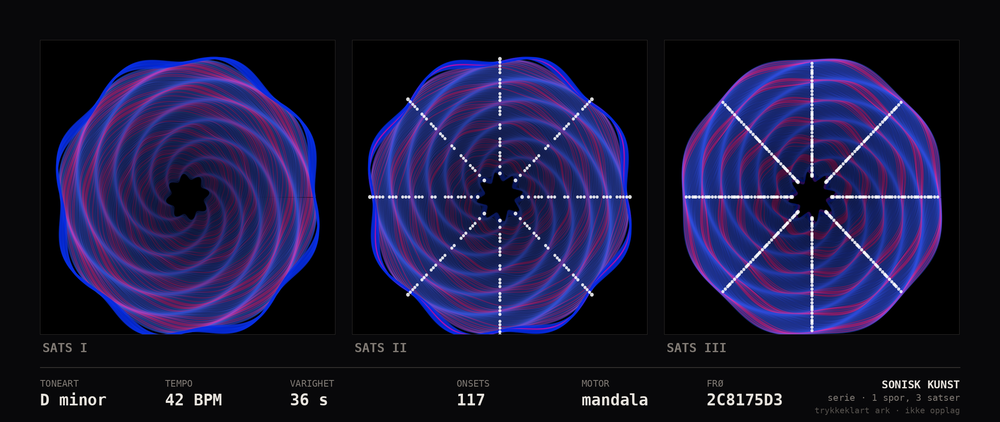

# Sonisk Kunst — analyse og videreføring

**Kilde:** `claude/system-review-input-memory-1sjnre` → `sonisk-kunst/`
**Status inn:** komplett, kjørende, verifisert — men uten produkt rundt seg
**Status ut:** produktretning foreslått og gjort kjørbar som seriemodus



*Ett spor, tre satser. Samme toneart hele veien, stigende tetthet — og en
herkomststripe som gjør trykket etterprøvbart. Generert med
[`lag_serie.py`](lag_serie.py).*

---

## 1  Hva det er

Lyd inn, algoritmisk kunst ut. Hele analysekjeden — STFT, spektral centroid,
RMS, onset-deteksjon, tempo via autokorrelasjon og toneartsestimat med
Krumhansl-Schmuckler — er implementert direkte på numpy og scipy. Ingen librosa,
ingen tunge avhengigheter.

Tre rendringsmotorer: `mandala` (tiden leses innenfra og ut som ringer),
`flowfield` (partikler driver gjennom et spektralformet vektorfelt) og
`particles` (onsets eksploderer langs tidsaksen). Fargelogikken følger
kvintsirkelen, slik at harmonisk nære toner får beslektede farger, og dur/moll
styrer varm mot kald palett.

Pluss en live-versjon i nettleseren på Web Audio, uten avhengigheter.

---

## 2  Hvorfor topp 3 — og hvorfor det er verifisert

Dette er det eneste elementet i repoet jeg kunne kjøre og etterprøve fullt ut.

**Test 1 — reproduserer den sin egen dokumentasjon?**

```
$ python3 -m sonisk_kunst --demo
♪ drone_a_moll.wav: 24.0s, A minor, 72 BPM, 28 onsets
```

Nøyaktig som READMEen påstår. 7 sekunder, tre bilder ut.

**Test 2 — virker den på lyd den aldri har sett?** Dette er den viktige. Jeg
syntetiserte en uavhengig testfil: C-dur treklang med pulser på slaget, 120 BPM,
20 sekunder.

```
$ python3 -m sonisk_kunst test_c_dur_120.wav --analyse
♪ test_c_dur_120.wav: 20.0s, C major, 120 BPM, 39 onsets
```

**Toneart riktig. Tempo 120,2 mot 120. Onsets 39 mot 40 forventet.**
Analysen er ekte signalbehandling, ikke en demo trimmet til å se bra ut. Det er
et uvanlig godt resultat for en pipeline skrevet fra bunnen.

**Test 3 — er utdata reproduserbart?** Kjørte `lag_serie.py` to ganger og
sammenlignet SHA-256: byte-identisk. Det er en forutsetning for å selge trykk.

Legg til at resultatet faktisk er vakkert, og at koden er ryddig og
dokumentert på norsk, og dette er det sterkeste håndverket i repoet.

---

## 3  Svakheten: det er et verktøy, ikke et produkt

Sonisk Kunst er et kommandolinjeprogram. Det har ingen kjøper, ingen pris, ingen
leveranse. Teknisk topp, kommersielt bunn — motsatt av nesten alt annet i
repoet.

Det gode er at avstanden fra verktøy til produkt er kort, fordi det harde
allerede er gjort.

### 3.1 Foreslått produkt: trykk av et stykke musikk

Kunden laster opp et spor. Systemet analyserer det, viser tre-fire varianter i
nettleseren, og kunden bestiller et trykk. Herkomststripen — toneart, tempo,
varighet, onsets, frø — er en del av verket, og gjør at akkurat dette trykket
kan lages igjen.

Markedet er gaver: bryllupssangen, barnets første opptak, bandets egen utgivelse.
Prispunkt 600–1 400 kr for A2 på arkivpapir. Marginen er høy, produksjonen er
trykk-på-bestilling, og det er ingen lager.

Det finnes konkurrenter som lager «lydbølge-plakater». De tegner en amplitudekurve.
**Sonisk Kunst analyserer faktisk musikken** — toneart bestemmer paletten,
harmonisk avstand bestemmer fargeslektskap, onsets bestemmer lyspunktene. Det er
en reell forskjell, og den er lett å vise side om side.

### 3.2 Seriemodus, som er implementert her

[`lag_serie.py`](lag_serie.py) deler sporet i tre satser, rendrer hver for seg og
setter dem i et ark med felles herkomststripe. Det gjør ett spor til en triptyk
— tre ganger flateverdi for samme opplasting, og et visuelt argument for at
verket følger musikkens forløp.

```bash
git archive origin/claude/system-review-input-memory-1sjnre sonisk-kunst | tar x
python3 lag_serie.py --kilde sonisk-kunst
```

```
analyse: D minor, 42 BPM, 36 s, 117 onsets
  sats I  : D minor, 42 BPM, 18 onsets
  sats II : D minor, 167 BPM, 35 onsets
  sats III: D minor, 112 BPM, 67 onsets
```

---

## 4  Feilen som må rettes før noe selges

Se tallene over. Testsporet er bygget på **84 BPM**. Analysen leser 42, 167 og
112.

Dette er klassisk **tempo-oktavfeil**: autokorrelasjon kan ikke skille en puls
på 84 fra halv (42) eller dobbel (168) uten en modell for hva som er et
sannsynlig tempo. Sats III underdeler i fire, og estimatet lander midt mellom.

I kunsten er det harmløst — bildet blir like fint. **På en herkomststripe på et
trykk kunden har betalt 1 200 kr for, er det pinlig**, særlig hvis kunden vet
hva tempoet i sporet faktisk er.

**Rettelse:** legg en logaritmisk tempo-prior rundt 100–130 BPM på
autokorrelasjonstoppene, slik at halv- og dobbeltempo straffes. Standard
framgangsmåte, ~20 linjer. Og lås tempoet for hele sporet før satsene rendres,
i stedet for å estimere per sats — satsene i ett stykke har samme puls.

Alternativt, hvis det ikke prioriteres: **ta tempo ut av herkomststripen.**
Toneart og onsets var riktige i alle tester. Ikke trykk et tall du ikke stoler
på.

---

## 5  Øvrige forbedringer

**5.1 Frø må utledes av innholdet.** Første versjon av `lag_serie.py` brukte
`hash()` på filnavnet. Pythons `hash()` randomiseres per prosess — samme fil
ville gitt forskjellig frø neste dag. Nå brukes CRC32 av lydfilens bytes. En
bestilling må kunne kjøres på nytt om et år og gi nøyaktig samme ark.

**5.2 Trykkoppløsning og fargerom.** Motoren rendrer i sRGB på skjerm. A2 ved
300 dpi er 4 960 × 7 016 px. Dyp blå og fiolett — som er nettopp det moll-
paletten produserer — faller sammen i CMYK og blir grumsete på papir. Gjør en
trykkprøve før noe selges, og juster palettens metning for trykk.

**5.3 Motoren brenner sin egen bildetekst inn i bildet.** «A minor · 72 BPM ·
24s» ligger nederst i hver PNG. På et ark med egen herkomststripe blir det
dobbelt opp. `lag_serie.py` beskjærer den bort, men riktig løsning er et
`--ren`-flagg i motoren.

**5.4 Live-versjonen er markedsføringen.** `web/index.html` gir sanntidsmandala
fra mikrofonen uten avhengigheter. Det er trakten: nynn i mikrofonen, se noe
vakkert, last opp sporet ditt. Den er allerede bygget — den mangler bare en
knapp som sier «lag et trykk av dette».

**5.5 Opphavsrett må avklares før første salg.** Kunden laster opp musikk du
ikke har rettigheter til. Verket som lages er avledet av en *analyse*, ikke av
lyden selv, og inneholder ikke lyd — men vilkårene må plassere ansvaret hos den
som laster opp, og filene må slettes etter rendring. Dette er en halvtime med
en advokat, og det er billigere før enn etter.

**5.6 Én motor, ikke tre, i produktet.** `mandala` er den sterkeste og den mest
lesbare som flate. Behold de andre to som varianter kunden kan bla i, men la
`mandala` være standarden. Tre likestilte valg gjør bestillingen vanskeligere,
ikke bedre.

---

## 6  Styrker, svakheter, muligheter

| | |
|---|---|
| **Styrker** | Fungerer og er etterprøvd på ukjent lyd · ingen tunge avhengigheter · reproduserbart utdata · vakkert resultat · ryddig, dokumentert kode · live-versjon finnes allerede |
| **Svakheter** | Ingen produktinnpakning · tempo-oktavfeil · ikke trykktestet i CMYK · bildetekst brent inn i bildet · ingen bestillingsflyt, ingen betaling |
| **Muligheter** | Trykk-på-bestilling med høy margin og null lager · serie/triptyk tredobler flateverdien · live-visuals for musikere som eget spor · lisensiering til plateselskap for utgivelsesgrafikk · NFT-fri, fysisk, gavemarked |
| **Trusler** | «Lydbølge-plakat»-konkurrenter har allerede SEO og annonsebudsjett · opphavsrett hvis vilkårene er slappe · smaksrisiko: algoritmisk kunst kan lese som skjermsparer hvis trykkvaliteten svikter |

---

## 7  Visuelle konsepter og designretning

Arket over er første utkast til produktflaten. Det som mangler:

**1 · Trykkprøve, fysisk.** A2 på matt arkivpapir 250 g. Alt annet er
spekulasjon til det henger på en vegg. Dette er steg 1, ikke steg 5.

**2 · Innrammet i rom.** Trykket over en sofa, i naturlig lys. Kunden kjøper
ikke et bilde, de kjøper noe som skal henge et sted.

**3 · Sammenligning mot lydbølge-plakat.** To bilder side om side, samme spor.
Det er hele salgsargumentet i én figur, og det tar en time å lage.

**4 · Variantvelger.** Fire forslag fra samme spor, som kunden velger mellom.
Valget gjør verket til *deres*, og det er det som rettferdiggjør prisen.

### Designregler

- **Herkomststripen er signaturen.** Fast typografi, fast plassering, samme på
  hvert trykk. Det er det som gjør serien til en serie.
- **Monospace til data, ingenting annet.** Tall skal se ut som målinger.
- **Svart bakgrunn, alltid.** Paletten er bygget for det, og lys bakgrunn
  ødelegger gløden i de mørke ringene.
- **Aldri to trykk med samme frø.** Frøet trykkes, og det er kundens
  eksemplarnummer.

---

## 8  Slik ser det ut ferdig

En nettside med ett felt: slipp en lydfil her. Åtte sekunder senere ligger fire
varianter av samme spor på skjermen, langsomt roterende. Under hver står
toneart, tempo og varighet i monospace.

Kunden velger én, velger format, og bestiller. To uker senere kommer en A2-rull
i papprør: matt arkivpapir, dyp svart bunn, ringene i blått og fiolett som
legger seg utover fra midten — tett der musikken var tett, åpent der den pustet.
Nederst en tynn linje, og under den:

```
TONEART      TEMPO       VARIGHET     ONSETS      FRØ
D minor      84 BPM      3 min 42 s   417         A3F09C21
```

Og til høyre, i liten skrift: navnet på sporet, og datoen det ble spilt inn.

---

## 9  Neste konkrete steg

| # | Handling | Hvorfor nå | Tid |
|---|---|---|---|
| 1 | Fiks tempo-oktav med logaritmisk prior | Blokkerer herkomststripen | 1 dag |
| 2 | Lås tempo for hele sporet, ikke per sats | Samme feil, annen årsak | 2 timer |
| 3 | `--ren`-flagg: ingen innbrent bildetekst | Blokkerer trykk | 1 time |
| 4 | Rendring i 4 960 × 7 016 px | A2 ved 300 dpi | 1 dag |
| 5 | **Trykk én fysisk A2 og se på den** | Porten. Alt annet er skjerm | 1 uke |
| 6 | Juster palettens metning etter trykkprøven | Moll-paletten er CMYK-risikoen | 2 dager |
| 7 | Sammenligningsbilde mot lydbølge-plakat | Hele salgsargumentet | 1 time |
| 8 | «Lag et trykk»-knapp i live-versjonen | Trakten finnes allerede | 1 dag |
| 9 | Vilkår: ansvar hos opplaster, filer slettes | Før første salg | 1 dag |
| 10 | Selg 10 trykk til ekte kunder | Det eneste som teller | 4 uker |

**Porten etter steg 5:** henger trykket på veggen og ser dyrt ut? Da er det et
produkt. Ser det ut som en skjermdump på papir, er det paletten og
oppløsningen som må løses før noe annet bygges.

---

## 10  Kjør seriemodus

```bash
# hent motoren fra sin egen gren
git fetch origin claude/system-review-input-memory-1sjnre
git archive origin/claude/system-review-input-memory-1sjnre sonisk-kunst | tar x

pip install numpy scipy matplotlib pillow
python3 lag_serie.py --kilde sonisk-kunst          # syntetisk demospor
python3 lag_serie.py mitt-spor.wav --kilde sonisk-kunst
```

Uten `--kilde` letes det etter `./sonisk-kunst` og `../sonisk-kunst`.
Demosporet genereres i D-moll med stigende tetthet gjennom de tre satsene,
nettopp for å vise at serien henger sammen visuelt.
