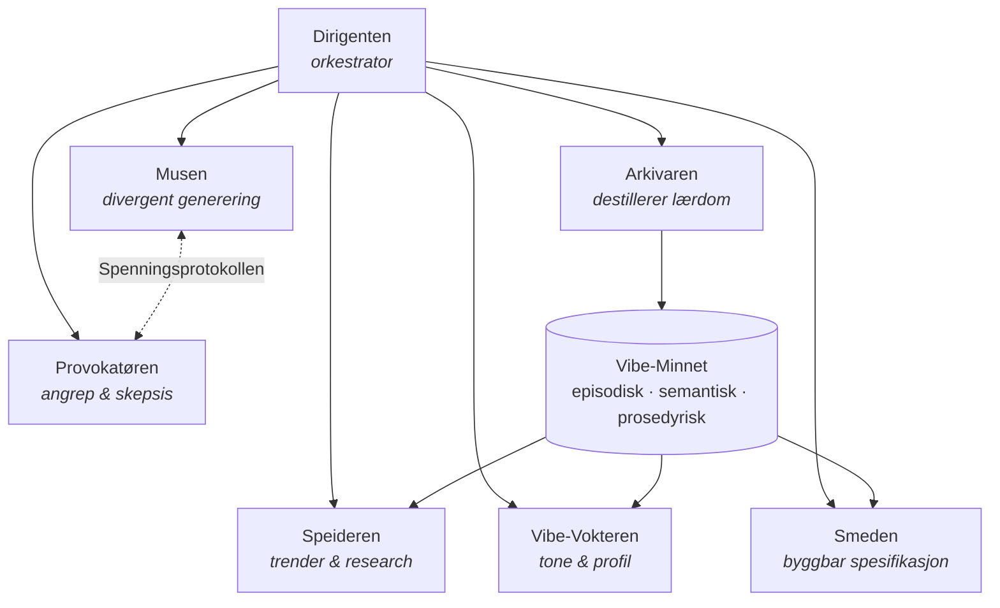
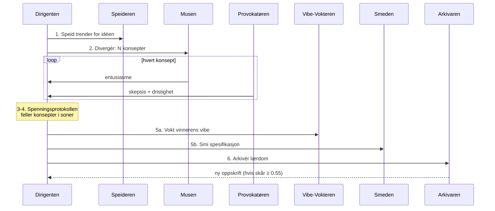

# VIBESMIA — Arkitektur og designresonnement

> Den autonome kreative smia: et multi-agent-system som forvandler rå idéer
> til produksjonsklare kreative leveranser.

## 1. Problemet

Dette repoet inneholder 100+ idéer: musikk, satire, videoer, Vibe-kort-apper.
Flaskehalsen er aldri idéene — det er reisen fra rå idé til noe byggbart.
Den reisen krever research, divergent tenkning, kritikk, tone-kontroll og
spesifisering. I 2026 er dette en jobb for et *lag* av agenter, ikke én modell.

## 2. Research-grunnlag (web-søk, juli 2026)

Tre funn fra søkene formet designet:

1. **Orchestrator–subagent er anbefalt standardmønster.** Produksjonslitteraturen
   i 2026 konvergerer på en sentral orkestrator med spesialiserte under-agenter,
   og advarer mot å innføre mer koordineringskompleksitet enn oppgaven krever.
2. **Tre-lags minne er konvergert praksis.** Episodisk (hva skjedde), semantisk
   (hva vet vi) og prosedyrisk (hva fungerer) — speiler kognitiv vitenskap og
   skiller prototyper fra produksjonsagenter.
3. **Kreative arbeidsflyter er modne for agentifisering.** Skaperflyten
   «idé → tekst → stil → utkast → feedback → versjoner» er allerede standard;
   78 % av innholdsskapere bruker AI i videoproduksjon (opp fra 32 % i 2025).

## 3. Det originale bidraget: Spenningsprotokollen

Kjente multi-agent-mønstre bruker **generator–verifikator**: én agent lager,
én godkjenner. Det fungerer for korrekthet, men er gift for kreativitet —
konsensus flater ut alt som er interessant.

VIBESMIA snur dette: uenighet er ikke støy som skal elimineres, men **et
signal som skal måles**. Musen (entusiasme) og Provokatøren (skepsis) er
*designet* for å være uenige, og protokollen beregner:

```
spenning = 0.6 · dristighet + 0.4 · |entusiasme − (1 − skepsis)|
```

Konsepter felles i tre soner:

| Sone | Spenning | Betydning | Skjebne |
|---|---|---|---|
| **Blast** | < 0.30 | Trygt, blekt, alle er enige | Forkastes |
| **Gullsonen** | 0.30–0.75 | Produktiv uenighet | Smis videre |
| **Hybris** | > 0.75 | Spennende, men ugjennomførbart | Forkastes |

Vinneren er konseptet **nærmest gullsonens midtpunkt** — der uenigheten er
mest produktiv. Så vidt vi vet finnes ingen publisert agentarkitektur som
selekterer på et målt spenningsbånd i stedet for konsensus eller flertall.

## 4. Agentene



| Agent | Rolle | Minne-tilgang |
|---|---|---|
| **Dirigenten** | Orkestrerer Gullsmeltingen, eier kvalitetsporten | Skriver episodisk |
| **Speideren** | Web-søk og trend-research | Skriver semantisk (trender) |
| **Musen** | Genererer N dristige konsepter med bevisste «vrier» | Leser semantisk |
| **Provokatøren** | Angriper hvert konsept: klisjé? hybris? | — |
| **Vibe-Vokteren** | Skårer mot vibe-profilen (tone, målgruppe, unngå-liste) | Leser semantisk (profil) |
| **Smeden** | Smir vinneren til spesifikasjon med leveranseplan | Leser prosedyrisk (oppskrifter) |
| **Arkivaren** | Destillerer vellykkede smeltinger til oppskrifter | Skriver alle tre lag |

## 5. Gullsmeltingen (pipelinen)



## 6. Vibe-Minnet

Én JSON-fil, tre lag, full proveniens (hver hendelse har kilde-agent og
tidsstempel via meldingsbussen):

- **Episodisk** — hendelseslogg per smelting. Gjør hver kjøring reviderbar.
- **Semantisk** — vibe-profiler (tone, målgruppe, unngå-liste) og trender
  Speideren har sanket. Vibe-Vokteren håndhever profilen.
- **Prosedyrisk** — *oppskrifter*: bare smeltinger med samlet skår ≥ 0.55
  destilleres. Smeden gjenbruker de beste i neste smelting — systemet
  starter smartere for hver runde.

Dette er selvforbedring uten finjustering: læringen bor i minnet, ikke i
modellvektene.

## 7. Tekniske valg

- **Ren Python-stdlib i kjernen** — demoen kjører uten installasjon, og
  `HeuristiskHjerne` er deterministisk (SHA-256-seedet RNG) så kjøringer er
  reproduserbare og testbare.
- **Hjerne-abstraksjonen** (`adapters.py`) skiller agentlogikk fra LLM-kall.
  `ClaudeHjerne` bruker Claude Opus 4.8 med adaptiv tenkning
  (`thinking: {"type": "adaptive"}`) og `effort: "high"` — 2026-anbefalt
  konfigurasjon. I produksjon får Speideren i tillegg server-side web-søk
  (`web_search_20260209`).
- **Meldingsbuss med logg** — all agent-kommunikasjon går gjennom
  `MeldingsBuss`, som gir gratis proveniens til episodisk minne.
- **Orkestrator-mønsteret, ikke peer-to-peer** — i tråd med 2026-rådet om at
  koordineringskompleksitet skal følge oppgavekompleksitet: én dirigent,
  seks spesialister, ingen unødvendig koreografi.

## 8. Videre arbeid

1. **Ekte web-søk i Speideren** via Claude API server-tools.
2. **Adaptiv gullsone** — la GULV/TAK justeres av Arkivaren basert på hvilke
   spenningsnivåer som historisk ga leveranser brukeren likte.
3. **Parallelle smeltinger** — kjør flere idéer samtidig med delte trender
   men separate spenningsmålinger.
4. **Vibe-kort-integrasjon** — eksporter spesifikasjoner som Vibe-kort
   (repoets eget format) klare for salgsmateriell.

## Kilder

- [Multi-Agent Orchestration: 5 Patterns That Work in 2026](https://www.digitalapplied.com/blog/multi-agent-orchestration-5-patterns-that-work)
- [6 Multi-Agent Orchestration Patterns for Production (2026)](https://beam.ai/agentic-insights/multi-agent-orchestration-patterns-production)
- [Choosing the right orchestration pattern for multi-agent systems](https://www.kore.ai/blog/choosing-the-right-orchestration-pattern-for-multi-agent-systems)
- [AI Agent Memory 2026: Progress Benchmark Report](https://mem0.ai/blog/state-of-ai-agent-memory-2026)
- [AI Agent Memory Architectures: From Context Windows to Persistent Knowledge](https://zylos.ai/research/2026-04-05-ai-agent-memory-architectures-persistent-knowledge/)
- [Long-Term Memory Architectures for AI Agents (Redis)](https://redis.io/blog/long-term-memory-architectures-ai-agents/)
- [AI Music Creation Tools 2026: Complete Workflow Guide](https://musicmake.ai/blog/ai-music-creation-tools-2026)
- [AI Music Video Generation: 10 Tools That Automate Your Creative Workflow in 2026](https://roboticsandautomationnews.com/2026/07/01/ai-music-video-generation-10-tools-that-automate-your-creative-workflow-in-2026/102946/)
